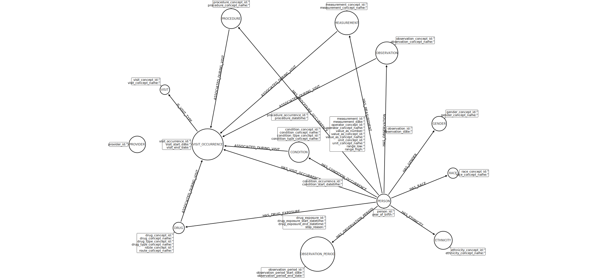

# Schema Draft

## Option 2

### Feedback

2020-07-07 - this is not an optimal design for a graph schema.  It over-utilizes edges to represent the data, and should be ignored.  Discussion on this design resulted in [Schema Draft 3](draft_schema_option3.md)

### Design

In this approach, I am ignoring PROVIDER entirely.  This is perhaps being lazy, but I'm trying to figure out what questions there may be that actually require knowing the provider.  I think most often we want to know that something occurred at the same visit (so the link to VISIT_OCCURRENCE is important), but it doesn't matter who actually did it.

The counter to this may be if we need to know that something was done by a provider of a specific specialty.  If that is the case, note that we don't have that data loaded for PROVIDER so it would have to be loaded before we could model this.

Note that we primarily have general concepts as nodes (`PROCEDURE`, `MEASUREMENT`, `OBSERVATION`, `GENDER`, `RACE`, `ETHNICITY`, `CONDITION`, `DRUG`).  These are the higher level concepts (e.g., the node is the concept of T2DM, not a single instance of it).  The edges will then capture the actual instances (occurrences) of each of these.

Because we often want to aggregate things to a single encounter (visit), we do have a `VISIT_OCCURRENCE` node that represents a specific visit for a patient.  This then allows relationships to all of the other nodes that could be assigned during that visit.

Because a visit is optional, we are also directly assigning relationships between `PERSON` and each of these other data concept nodes.  I'm not sure if this is duplication of data, though.  It was one solution to let us see (for example) all procedures a patient has had, while also navigating via the `VISIT_OCCURRENCE` the diagnosis given in the visit when a procedure was done.


### Diagram


### Arrow Markup

[For use in Arrow](http://www.apcjones.com/arrows/#)

```
<ul class="graph-diagram-markup" data-internal-scale="2.27" data-external-scale="1">
  <li class="node" data-node-id="0" data-x="-1245.6302418428295" data-y="307.9464183134191">
    <span class="caption">DRUG</span><dl class="properties"><dt>drug_concept_id</dt><dd>''</dd><dt>drug_concept_name</dt><dd>''</dd><dt>drug_type_concept_id</dt><dd>''</dd><dt>drug_type_concept_name</dt><dd>''</dd><dt>route_concept_id</dt><dd>''</dd><dt>route_concept_name</dt><dd>''</dd></dl></li>
  <li class="node" data-node-id="1" data-x="225.96926537459612" data-y="115.28160526382398">
    <span class="caption">PERSON</span><dl class="properties"><dt>person_id</dt><dd>''</dd><dt>year_of_birth</dt><dd>''</dd></dl></li>
  <li class="node" data-node-id="2" data-x="-1038.1231460579836" data-y="-292.02290797513064">
    <span class="caption">VISIT_OCCURRENCE</span><dl class="properties"><dt>visit_occurrence_id</dt><dd>''</dd><dt>visit_start_date</dt><dd>''</dd><dt>visit_end_date</dt><dd>''</dd></dl></li>
  <li class="node" data-node-id="3" data-x="623.4260318436814" data-y="-441.0420791693188">
    <span class="caption">GENDER</span><dl class="properties"><dt>gender_concept_id</dt><dd>''</dd><dt>gender_concept_name</dt><dd>''</dd></dl></li>
  <li class="node" data-node-id="4" data-x="722.8512474765856" data-y="-85.81871139301968">
    <span class="caption">RACE</span><dl class="properties"><dt>race_concept_id</dt><dd>''</dd><dt>race_concept_name</dt><dd>''</dd></dl></li>
  <li class="node" data-node-id="5" data-x="652.4610203142211" data-y="396.81680203744463">
    <span class="caption">ETHNICITY</span><dl class="properties"><dt>ethnicity_concept_id</dt><dd>''</dd><dt>ethnicity_concept_name</dt><dd>''</dd></dl></li>
  <li class="node" data-node-id="6" data-x="-383.2077572524273" data-y="-236.12565700178004">
    <span class="caption">CONDITION</span><dl class="properties"><dt>condition_concept_id</dt><dd>''</dd><dt>condition_concept_name</dt><dd>''</dd><dt>condition_type_concept_id</dt><dd>''</dd><dt>condition_type_concept_name</dt><dd>''</dd></dl></li>
  <li class="node" data-node-id="7" data-x="-1543.3049926757826" data-y="-292.02290797513064">
    <span class="caption">PROVIDER</span><dl class="properties"><dt>provider_id</dt><dd>''</dd></dl></li>
  <li class="node" data-node-id="8" data-x="-869.1121151289751" data-y="-1195.3802078852054">
    <span class="caption">PROCEDURE</span><dl class="properties"><dt>procedure_concept_id</dt><dd>''</dd><dt>procedure_concept_name</dt><dd>''</dd></dl></li>
  <li class="node" data-node-id="9" data-x="-39.443950027343746" data-y="-1164.7024349263024">
    <span class="caption">MEASUREMENT</span><dl class="properties"><dt>measurement_concept_id</dt><dd>''</dd><dt>measurement_concept_name</dt><dd>''</dd></dl></li>
  <li class="node" data-node-id="10" data-x="247.49786430728588" data-y="-948.5297932225709">
    <span class="caption">OBSERVATION</span><dl class="properties"><dt>observation_concept_id</dt><dd>''</dd><dt>observation_concept_name</dt><dd>''</dd></dl></li>
  <li class="node" data-node-id="11" data-x="-249.38931952933987" data-y="495.78242929601413">
    <span class="caption">OBSERVATION_PERIOD</span><dl class="properties"><dt>observation_period_id</dt><dd>''</dd><dt>observation_period_start_date</dt><dd>''</dd><dt>observation_period_end_date</dt><dd>''</dd></dl></li>
  <li class="node" data-node-id="12" data-x="-1345.0560757137068" data-y="-685.1783587081842">
    <span class="caption">VISIT</span><dl class="properties"><dt>visit_concept_id</dt><dd>''</dd><dt>visit_concept_name</dt><dd>''</dd></dl></li>
  <li class="relationship" data-from="1" data-to="0">
    <span class="type">HAS_DRUG_EXPOSURE</span><dl class="properties"><dt>drug_exposure_id</dt><dd>''</dd><dt>drug_exposure_start_datetime</dt><dd>''</dd><dt>drug_exposure_end_datetime</dt><dd>''</dd><dt>stop_reason</dt><dd>''</dd></dl></li>
  <li class="relationship" data-from="0" data-to="2">
    <span class="type">ASSOCIATED_DURING_VISIT</span>
  </li>
  <li class="relationship" data-from="1" data-to="2">
    <span class="type">HAS_VISIT_OCCURRENCE</span>
  </li>
  <li class="relationship" data-from="1" data-to="3">
    <span class="type">HAS_GENDER</span>
  </li>
  <li class="relationship" data-from="1" data-to="4">
    <span class="type">HAS_RACE</span>
  </li>
  <li class="relationship" data-from="1" data-to="5">
    <span class="type">HAS_ETHNICITY</span>
  </li>
  <li class="relationship" data-from="1" data-to="6">
    <span class="type">HAS_CONDITION_OCCURRENCE</span><dl class="properties"><dt>condition_occurrence_id</dt><dd>''</dd><dt>condition_start_datetime</dt><dd>''</dd></dl></li>
  <li class="relationship" data-from="6" data-to="2">
    <span class="type">ASSOCIATED_DURING_VISIT</span>
  </li>
  <li class="relationship" data-from="1" data-to="8">
    <span class="type">HAS_PROCEDURE_OCCURRENCE</span><dl class="properties"><dt>procedure_occurrence_id</dt><dd>''</dd><dt>procedure_datetime</dt><dd>''</dd></dl></li>
  <li class="relationship" data-from="8" data-to="2">
    <span class="type">ASSOCIATED_DURING_VISIT</span>
  </li>
  <li class="relationship" data-from="1" data-to="9">
    <span class="type">HAS_MEASUREMENT</span><dl class="properties"><dt>measurement_id</dt><dd>''</dd><dt>measurement_date</dt><dd>''</dd><dt>operator_concept_id</dt><dd>''</dd><dt>operator_concept_name</dt><dd>''</dd><dt>value_as_number</dt><dd>''</dd><dt>value_as_concept_id</dt><dd>''</dd><dt>value_as_concept_name</dt><dd>''</dd><dt>unit_concept_id</dt><dd>''</dd><dt>unit_concept_name</dt><dd>''</dd><dt>range_low</dt><dd>''</dd><dt>range_high</dt><dd>''</dd></dl></li>
  <li class="relationship" data-from="9" data-to="2">
    <span class="type">ASSOCIATED_DURING_VISIT</span>
  </li>
  <li class="relationship" data-from="1" data-to="10">
    <span class="type">HAS_OBSERVATION</span><dl class="properties"><dt>observation_id</dt><dd>''</dd><dt>observation_date</dt><dd>''</dd></dl></li>
  <li class="relationship" data-from="10" data-to="2">
    <span class="type">ASSOCIATED_DURING_VISIT</span>
  </li>
  <li class="relationship" data-from="1" data-to="11">
    <span class="type">HAS_OBSERVATION_PERIOD</span>
  </li>
  <li class="relationship" data-from="2" data-to="12">
    <span class="type">IS_VISIT_TYPE</span>
  </li>
</ul>
```