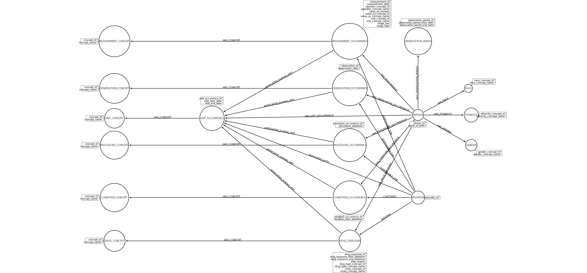

# Schema Draft

## Option 3 (v2)

### Feedback

(Under review)

### Design

In this version, we have moved from the "edge-heavy" approach in [Option 2] to one that is more optimized.  Here we have a node for each occurrence/exposure of some clinical action.  This means we have `*_OCCURRENCE` or `*_EXPOSURE` nodes for (`PROCEDURE`, `MEASUREMENT`, `OBSERVATION`, `CONDITION`, `DRUG`).  Each of these is related to a node that represents the specific higher level concepts (e.g., a node that is the concept of T2DM, not a single instance of it).

We now include `PROVIDER` as well, noting that a provider can be associated optionally with each data element.  The relationship names for `PROVIDER` are not the same, but are based on the descriptions in the [OMOP CDM](https://github.com/OHDSI/CommonDataModel/wiki).

**NOTE**
> We have diagrammed each concept (left-most and right-most sides of figure) as their own nodes in this schema.  We are considering initially to use a single `CONCEPT` node to represent every concept, and evaluate performance.  If we find that there are issues, we will look to split the concepts into data element-specific nodes.  For now, consider those multiple nodes to actually collapse under a single `CONCEPT` node label.

Because we often want to aggregate things to a single encounter (visit), we have a `VISIT_OCCURRENCE` node that represents a specific visit for a patient.  This then allows relationships to all of the other nodes that could be assigned during that visit.  Since a visit is optional, we are also directly assigning relationships between `PERSON` and each of these other data concept nodes.

**NOTE**
> For our specific study (SCRIPT), we anticipate having a `VISIT_OCCURRENCE` associated with _every_ data element.  This is not required by the OMOP schema, and so we are accounting for where a visit occurrence may or may not exist in this design.

### Diagram


### Arrow Markup
[For use in Arrow](http://www.apcjones.com/arrows/#)

```
<ul class="graph-diagram-markup" data-internal-scale="2.27" data-external-scale="1">
  <li class="node" data-node-id="0" data-x="371.4498876535569" data-y="605.4527960839318">
    <span class="caption">DRUG_EXPOSURE</span><dl class="properties"><dt>drug_exposure_id</dt><dd>''</dd><dt>drug_exposure_start_datetime</dt><dd>''</dd><dt>drug_exposure_end_datetime</dt><dd>''</dd><dt>stop_reason</dt><dd>''</dd><dt>drug_type_concept_id</dt><dd>''</dd><dt>drug_type_concept_name</dt><dd>''</dd><dt>route_concept_id</dt><dd>''</dd><dt>route_concept_name</dt><dd>''</dd></dl></li>
  <li class="node" data-node-id="1" data-x="993.4215557793323" data-y="-542.8533458865409">
    <span class="caption">PERSON</span><dl class="properties"><dt>person_id</dt><dd>''</dd><dt>year_of_birth</dt><dd>''</dd></dl></li>
  <li class="node" data-node-id="2" data-x="-882.9805330116853" data-y="-512.9594108144619">
    <span class="caption">VISIT_OCCURRENCE</span><dl class="properties"><dt>visit_occurrence_id</dt><dd>''</dd><dt>visit_start_date</dt><dd>''</dd><dt>visit_end_date</dt><dd>''</dd></dl></li>
  <li class="node" data-node-id="3" data-x="1478.0652952488292" data-y="-267.60673018804135">
    <span class="caption">GENDER</span><dl class="properties"><dt>gender_concept_id</dt><dd>''</dd><dt>gender_concept_name</dt><dd>''</dd></dl></li>
  <li class="node" data-node-id="4" data-x="1452.1155345429438" data-y="-785.8288615126163">
    <span class="caption">RACE</span><dl class="properties"><dt>race_concept_id</dt><dd>''</dd><dt>race_concept_name</dt><dd>''</dd></dl></li>
  <li class="node" data-node-id="5" data-x="1478.0652952488292" data-y="-542.8533458865409">
    <span class="caption">ETHNICITY</span><dl class="properties"><dt>ethnicity_concept_id</dt><dd>''</dd><dt>ethnicity_concept_name</dt><dd>''</dd></dl></li>
  <li class="node" data-node-id="6" data-x="371.4498876535569" data-y="210.14233223667327">
    <span class="caption">CONDITION_OCCURRENCE</span><dl class="properties"><dt>condition_occurrence_id</dt><dd>''</dd><dt>condition_start_datetime</dt><dd>''</dd></dl></li>
  <li class="node" data-node-id="7" data-x="993.4215557793323" data-y="210.14233223667327">
    <span class="caption">PROVIDER</span><dl class="properties"><dt>provider_id</dt><dd>''</dd></dl></li>
  <li class="node" data-node-id="8" data-x="371.4498876535569" data-y="-267.60673018804135">
    <span class="caption">PROCEDURE_OCCURRENCE</span><dl class="properties"><dt>procedure_occurrence_id</dt><dd>''</dd><dt>procedure_datetime</dt><dd>''</dd></dl></li>
  <li class="node" data-node-id="9" data-x="371.4498876535569" data-y="-1215.4018924393797">
    <span class="caption">MEASUREMENT_OCCURRENCE</span><dl class="properties"><dt>measurement_id</dt><dd>''</dd><dt>measurement_date</dt><dd>''</dd><dt>operator_concept_id</dt><dd>''</dd><dt>operator_concept_name</dt><dd>''</dd><dt>value_as_number</dt><dd>''</dd><dt>value_as_concept_id</dt><dd>''</dd><dt>value_as_concept_name</dt><dd>''</dd><dt>unit_concept_id</dt><dd>''</dd><dt>unit_concept_name</dt><dd>''</dd><dt>range_low</dt><dd>''</dd><dt>range_high</dt><dd>''</dd></dl></li>
  <li class="node" data-node-id="10" data-x="371.4498876535569" data-y="-785.8288615126163">
    <span class="caption">OBSERVATION_OCCURRENCE</span><dl class="properties"><dt>observation_id</dt><dd>''</dd><dt>observation_date</dt><dd>''</dd></dl></li>
  <li class="node" data-node-id="11" data-x="993.4215557793323" data-y="-1215.4018924393797">
    <span class="caption">OBSERVATION_PERIOD</span><dl class="properties"><dt>observation_period_id</dt><dd>''</dd><dt>observation_period_start_date</dt><dd>''</dd><dt>observation_period_end_date</dt><dd>''</dd></dl></li>
  <li class="node" data-node-id="12" data-x="-1771.9506775440097" data-y="-512.9594108144619">
    <span class="caption">VISIT_CONCEPT</span><dl class="properties"><dt>concept_id</dt><dd>''</dd><dt>concept_name</dt><dd>''</dd></dl></li>
  <li class="node" data-node-id="13" data-x="-1771.9506775440097" data-y="-785.8288615126163">
    <span class="caption">OBSERVATION_CONCEPT</span><dl class="properties"><dt>concept_id</dt><dd>''</dd><dt>concept_name</dt><dd>''</dd></dl></li>
  <li class="node" data-node-id="14" data-x="-1771.9506775440097" data-y="-1215.4018924393797">
    <span class="caption">MEASUREMENT_CONCEPT</span><dl class="properties"><dt>concept_id</dt><dd>''</dd><dt>concept_name</dt><dd>''</dd></dl></li>
  <li class="node" data-node-id="15" data-x="-1771.9506775440097" data-y="-267.60673018804135">
    <span class="caption">PROCEDURE_CONCEPT</span><dl class="properties"><dt>concept_id</dt><dd>''</dd><dt>concept_name</dt><dd>''</dd></dl></li>
  <li class="node" data-node-id="16" data-x="-1771.9506775440097" data-y="210.14233223667327">
    <span class="caption">CONDITION_CONCEPT</span><dl class="properties"><dt>concept_id</dt><dd>''</dd><dt>concept_name</dt><dd>''</dd></dl></li>
  <li class="node" data-node-id="17" data-x="-1771.9506775440097" data-y="605.4527960839318">
    <span class="caption">DRUG_CONCEPT</span><dl class="properties"><dt>concept_id</dt><dd>''</dd><dt>concept_name</dt><dd>''</dd></dl></li>
  <li class="relationship" data-from="1" data-to="0">
    <span class="type">HAS_DRUG_EXPOSURE</span>
  </li>
  <li class="relationship" data-from="0" data-to="2">
    <span class="type">ASSOCIATED_DURING_VISIT</span>
  </li>
  <li class="relationship" data-from="1" data-to="2">
    <span class="type">HAS_VISIT_OCCURRENCE</span>
  </li>
  <li class="relationship" data-from="1" data-to="3">
    <span class="type">HAS_GENDER</span>
  </li>
  <li class="relationship" data-from="1" data-to="4">
    <span class="type">HAS_RACE</span>
  </li>
  <li class="relationship" data-from="1" data-to="5">
    <span class="type">HAS_ETHNICITY</span>
  </li>
  <li class="relationship" data-from="1" data-to="6">
    <span class="type">HAS_CONDITION_OCCURRENCE</span>
  </li>
  <li class="relationship" data-from="6" data-to="2">
    <span class="type">ASSOCIATED_DURING_VISIT</span>
  </li>
  <li class="relationship" data-from="1" data-to="8">
    <span class="type">HAS_PROCEDURE_OCCURRENCE</span>
  </li>
  <li class="relationship" data-from="8" data-to="2">
    <span class="type">ASSOCIATED_DURING_VISIT</span>
  </li>
  <li class="relationship" data-from="1" data-to="9">
    <span class="type">HAS_MEASUREMENT</span>
  </li>
  <li class="relationship" data-from="9" data-to="2">
    <span class="type">ASSOCIATED_DURING_VISIT</span>
  </li>
  <li class="relationship" data-from="1" data-to="10">
    <span class="type">HAS_OBSERVATION_OCCURRENCE</span>
  </li>
  <li class="relationship" data-from="10" data-to="2">
    <span class="type">ASSOCIATED_DURING_VISIT</span>
  </li>
  <li class="relationship" data-from="1" data-to="11">
    <span class="type">HAS_OBSERVATION_PERIOD</span>
  </li>
  <li class="relationship" data-from="2" data-to="12">
    <span class="type">HAS_CONCEPT</span>
  </li>
  <li class="relationship" data-from="10" data-to="13">
    <span class="type">HAS_CONCEPT</span>
  </li>
  <li class="relationship" data-from="9" data-to="14">
    <span class="type">HAS_CONCEPT</span>
  </li>
  <li class="relationship" data-from="8" data-to="15">
    <span class="type">HAS_CONCEPT</span>
  </li>
  <li class="relationship" data-from="6" data-to="16">
    <span class="type">HAS_CONCEPT</span>
  </li>
  <li class="relationship" data-from="0" data-to="17">
    <span class="type">HAS_CONCEPT</span>
  </li>
  <li class="relationship" data-from="7" data-to="2">
    <span class="type">ASSOCIATED_WITH</span>
  </li>
  <li class="relationship" data-from="7" data-to="6">
    <span class="type">CAPTURED</span>
  </li>
  <li class="relationship" data-from="7" data-to="0">
    <span class="type">INITIATED</span>
  </li>
  <li class="relationship" data-from="7" data-to="8">
    <span class="type">RESPONSIBLE_FOR</span>
  </li>
  <li class="relationship" data-from="7" data-to="9">
    <span class="type">RESPONSIBLE_FOR</span>
  </li>
  <li class="relationship" data-from="7" data-to="10">
    <span class="type">RESPONSIBLE_FOR</span>
  </li>
</ul>
```